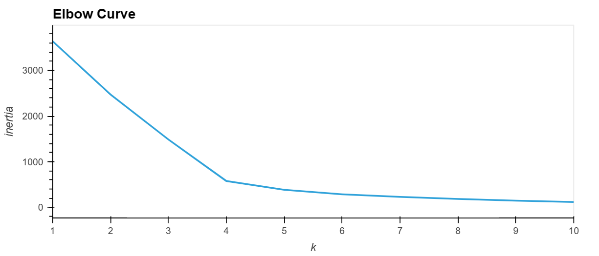
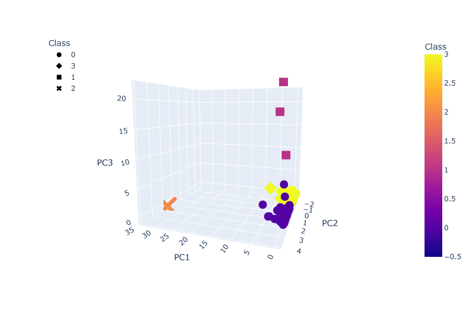
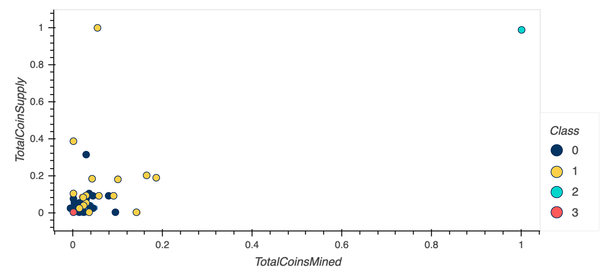

# Unsupervised Machine Learning and Cryptocurrencies

## Overview
Unsupervised learning is used for, how to process data, how to cluster, how to reduce your dimensions, and how to reduce the principal components using PCA. This project is putting all these skills to use by creating an analysis for clients who are preparing to get into the cryptocurrency market.

Accountability Accounting, a prominent investment bank, is interested in offering a new cryptocurrency investment portfolio for its customers. The company, however, is lost in the vast universe of cryptocurrencies. This project is to create a report that includes what cryptocurrencies are on the trading market and how they could be grouped to create a classification system for this new investment. 

To better analysis the data, it will need to be processed to fit the machine learning models. Specifically, to group the cryptocurrencies, we decided on a clustering algorithm using the unsupervised learning. In the meanwhile, we’ll use data visualizations to share all findings with the board.

## Summary
-  In this project, we firstly created an Elbow Curve to find the best value for k. 
 
-  Then, it prepares dataset for dimension reduction with PCA and clustered cryptocurrencies using K-Means; 
-  Once the best fit k value was found, we've used the k-means clustering algorithm to the predict the k clusters for the processed data. 

3D graph below is populated for visualization:

## Analysis
Per the scatter plot below, we can easily see the different class of cryptocurrencies sold out

